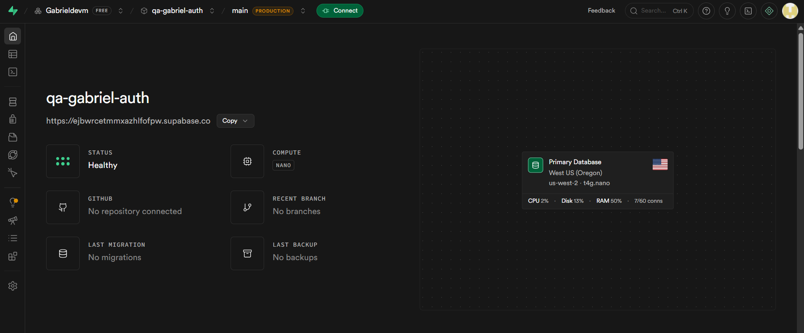
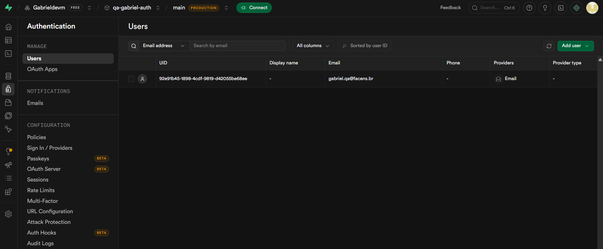
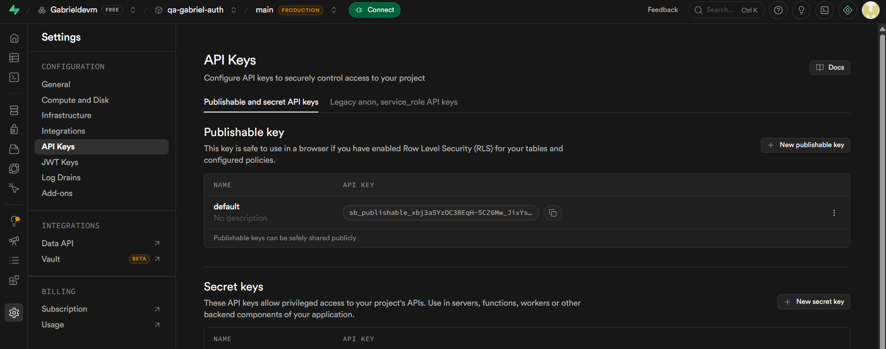
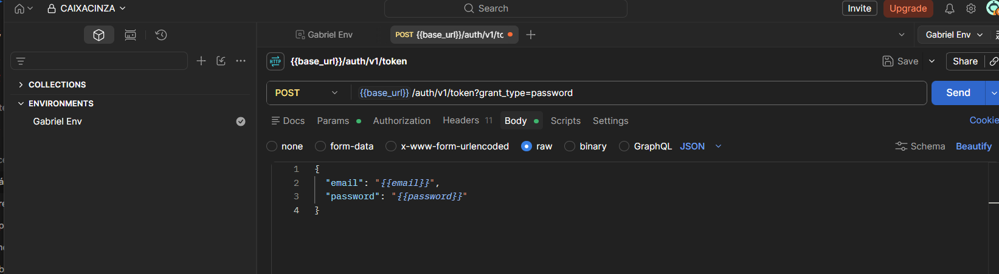

# Validação de API: Testes de Caixa Cinza com Supabase

## 1. Escopo do Projeto
Este repositório contém a documentação e execução de testes funcionais em uma API Rest. Utilizando as premissas de Teste de Caixa Cinza, o objetivo foi provisionar um serviço de autenticação na nuvem (Supabase) e validar as respostas do servidor (HTTP Status Codes, Body JSON e Headers) utilizando o Postman.

## 2. Estruturação do Backend (Supabase)
Para simular um ambiente de produção sem a necessidade de programar a infraestrutura, um projeto `qa-gabriel-auth` foi inicializado na plataforma Supabase.
* O provedor de e-mail/senha foi ativado.
* Foi inserido um usuário de testes diretamente no banco de dados (`gabriel.qa@facens.br`).
* As chaves públicas (`API Key`) e a rota raiz foram capturadas para uso no cliente de testes.

### Imagens da Configuração:




## 3. Preparação do Cliente de Testes (Postman)
No Postman, as boas práticas de testes foram seguidas isolando os dados de conexão através de Variáveis de Ambiente (*Environment*). As seguintes chaves foram cadastradas:
* `base_url`: URL do Supabase.
* `api_key`: Chave de acesso da API.
* `email` e `password`: Massa de dados estática para o teste positivo.

### Evidência do Postman:


## 4. Estrutura da Requisição POST
O disparo de teste foi configurado para a rota padrão de geração de tokens de sessão do Supabase.

* **Endpoint Alvo:** `/auth/v1/token?grant_type=password`
* **Método:** HTTP POST

**Cabeçalhos (Headers):**

| Header | Valor |
| :--- | :--- |
| `apikey` | [Chave Injetada via Variável] |
| `Content-Type` | `application/json` |

**Corpo da Requisição (Payload JSON):**

```json
{
  "email": "gabriel.qa@facens.br",
  "password": "SenhaForte#2026"
}
```
5. Bateria de Testes (Caixa Cinza)
Foram modelados cinco casos de teste para verificar a resiliência da API contra inputs indevidos.


6. Documentação (Planilha)
A matriz de rastreabilidade de testes foi documentada via planilha, garantindo que o histórico de validação do QA seja mantido para futuras regressões no código.


7. Análise Final e Conclusão
A bateria de testes demonstrou que o backend gerado pelo Supabase é altamente seguro e lida corretamente com as validações de input. Todos os cenários de erro foram barrados na porta (Status 400), e nenhuma informação sensível do banco de dados vazou nos responses. O token JWT foi gerado apenas sob condições ideais. A execução comprovou o valor do Teste de Caixa Cinza: por termos um conhecimento prévio da estrutura do JSON e dos Headers, conseguimos elaborar testes cirúrgicos que cobrem todas as vulnerabilidades comuns de uma rota de login.

Documentação feita por: Gabriel
